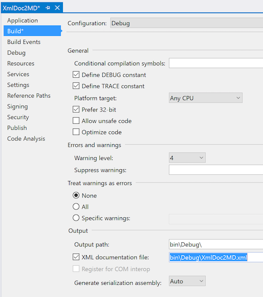
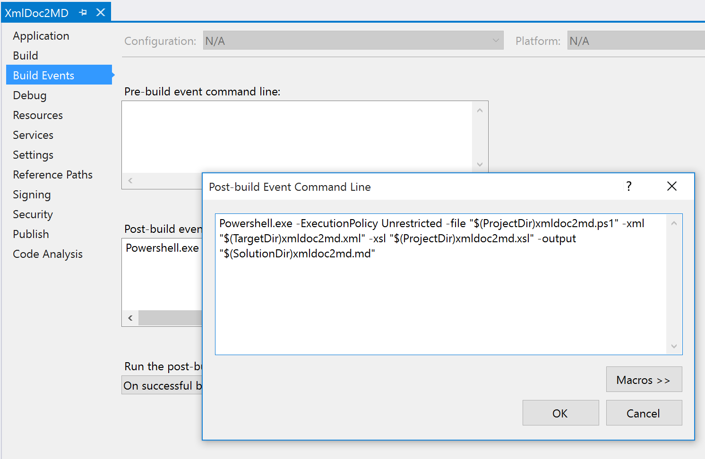
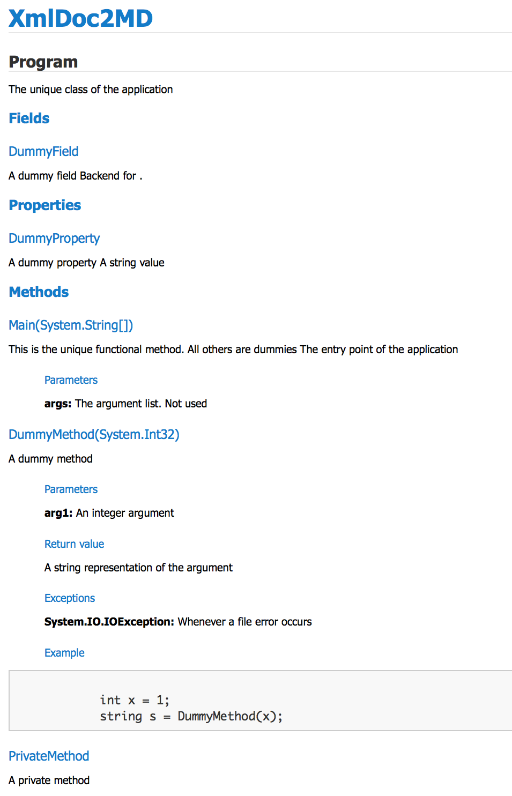

# xmldoc2md
Automatic documentation markdown (.md) formatter for Visual Studio projects, specially for projects published in TFS and github.

## Background
Visual Studio provides a facility for generating documentation in XML format right from the normalized /// comments, as described here: https://msdn.microsoft.com/en-us/library/z04awywx.aspx

There are many tools out there for transforming the generated xml documentation, including Sandcastle and some XML stylesheet files that can be found here at CodeProject. The traditional output is HTML, because that's the most universal format. CHM (help) and RTF (rich-text) formats are also used.

An emerging popular rich-text file format is Markdown (see http://en.wikipedia.org/wiki/Markdown), as a simpler alternative to HTML and RTF. It is used in github for simple and formattable README files, and now it is supported by Team Foundation Server including its cloud version: visualstudio.com

## Generating automatic xml documentation
For enabling the generation of xml documentation, there is an option in the Project Properties window, as shown:



This option is per project and per build configuration. It is important to be aware of the output folder, which is relative to the solution's root.

## Points of Interest
As mentioned before, the documentation is generated from normalized xml comments inside the source code. Here is a fragment from the provided source code:

````
    /// <summary>
    /// The unique class of the application
    /// </summary>
    class Program
    {
        /// <summary>
        /// The entry point of the application
        /// </summary>
        /// <remarks>This is the unique functional method. All others are dummies</remarks>
        /// <param name="args">The argument list. Not used</param>
        static void Main(string[] args)
        {
             /* Code removed */
        }

        /// <summary>
        /// A dummy method
        /// </summary>
        /// <param name="arg1">An integer argument</param>
        /// <returns>A string representation of the argument</returns>
        /// <exception cref="IOException">Whenever a file error occurs</exception>
        /// <example>
        /// <code>
        /// int x = 1;
        /// string s = DummyMethod(x);
        /// </code> 
        /// </example>
        public string DummyMethod(int arg1)
        {
            this.DummyProperty = arg1.ToString();
            return this.DummyProperty;
        }
````        
        
After compiling, the resulting documentation file is an xml with a specific schema (see https://msdn.microsoft.com/en-us/library/fsbx0t7x.aspx). For the source code above, it will have the following aspect:

````
<?xml version="1.0"?>
<doc>
    <assembly>
        <name>XmlDoc2MD</name>
    </assembly>
    <members>
        <member name="T:XmlDocToMD.Program">
            <summary>
            The unique class of the application
            </summary>
        </member>
        <member name="M:XmlDocToMD.Program.Main(System.String[])">
            <summary>
            The entry point of the application
            </summary>
            <remarks>This is the unique functional method. All others are dummies</remarks>
            <param name="args">The argument list. Not used</param>
        </member>
        <member name="M:XmlDocToMD.Program.DummyMethod(System.Int32)">
            <summary>
            A dummy method
            </summary>
            <param name="arg1">An integer argument</param>
            <returns>A string representation of the argument</returns>
            <exception cref="T:System.IO.IOException">Whenever a file error occurs</exception>
            <example>
            <code>
            int x = 1;
            string s = DummyMethod(x);
            </code> 
            </example>
        </member>
````

## Generation of the MD file
The Markdown file is generated with the help of two files: a XML stylesheet (.xsl) and a Powershell script (.ps1). The stylesheet contains all the transformations required for transforming the xml file into a non-xml markdown format. At this point it is important to point out that the provided stylesheet is still a work in progress, and will be great to receive feedback from stylesheet experts.

For educational purposes, the sample C# application itself takes the same XSL file for producing the MD file. The Powershell script is an equivalent of that source code. 

The proposed way to use the tools is:

For each project
- Include the stylesheet into your project's root (xmldoc2md.xsl) 
- Include the Powershell script into your project's root (xmldoc2md.ps1)
- Create a post-build event that invokes the Powershell script and uses the stylesheet, as shown:



Take into account that, for this example, the input XML is coincidentally called xmldoc2md.xml, but in fact it can have any arbitrary name, usually the project name with .xml extension. 

Also it is very important to specify the correct paths to the input and output files, by using the Macros option.

If everything succeds, the resulting output is a markdown file with the formatted documentation. The final aspect will depend on the specific implementation. Visual Studio Online shows the following:


